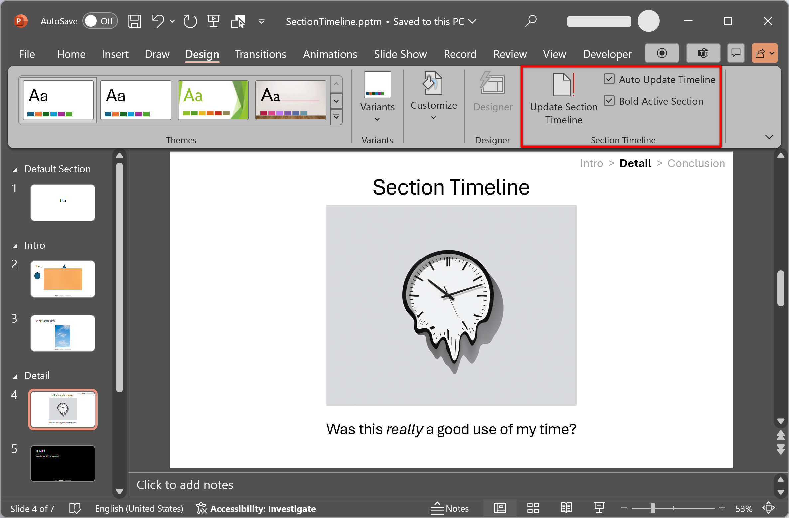

# PowerPoint Section Timeline Add-In

Automatically update an in-slide section timeline.

> The section timeline is located in the top right corner of the slide.

- [PowerPoint Section Timeline Add-In](#powerpoint-section-timeline-add-in)
    - [Features](#features)
        - [Section Timeline](#section-timeline)
        - [Change Video](#change-video)
        - [Add to Group](#add-to-group)
        - [Swap Animations](#swap-animations)
    - [Installation](#installation)

## Features

### Section Timeline

- Adds a command group called "Section Timeline" in the Design Tab.
- Creates a section timeline header for all slides with the "Footer" enabled (See:
  **Insert > Header & Footer**)
- The section timeline will only show up once there are at least 2 sections with
  valid names. Sections starting with `_` or `Default Section` will be ignored.
- Preserves the original formatting of the footer text box.
- Updates are triggered on new slides or when slides are re-arranged. This can
  be toggled on/off in the **Design > Section Status Bar > Auto Update Timeline**.
- Customize the separator between sections in **Design > Section Status Bar > Separator**.
- The current section is colored in black on slides with light backgrounds and
  white on slides with dark backgrounds. The current section is bolded by
  default, but this can be toggled in **Design > Section Status Bar > Bold Active Section**.

> [!IMPORTANT]
>
> If the entire text box is the "current section" color, (such as if there is
> only one initial section), when the text box is updated with new section text,
> the text will inherit that font color, so the text will no longer stand out.
> Click on the text box and click **Clear All Formatting** (next to font size
> adjustment) to revert the textbox to its original formatting. The next update
> will fix the highlighted text.

> [!NOTE]
>
> The "slide change" update is officially processed when the *selected* slide
> changes (due to PowerPoint limitations). If you move the currently selected
> slide, the update will not process until after you select a different slide.

### Change Video

- **Change Video**: Swap a video with another video on disk while preserving the
  animations.
    - Can be found in the right-click context menu for videos or in the "Video
      Format" tab, i.e., **Video Format > Change > Change Video**.
    - Note: Using this on a video in a (non-nested) group will work, however
      undoing the replace may corrupt the animations on the slide.

### Add to Group

- **Add to Group**: Add the selected shape to a group.
    - Found in the right-click context menu for shapes under the "Group" tab.
    - If a group is not selected, the two shapes will be grouped together while
      preserving the animations of the most recently selected shape with animations.
    - Does not work with nested groups. For subgroups, [swap the animations](#swap-animations)
      to another shape first, ungroup as many levels as necessary, then re-group
      and swap the animations back.

### Swap Animations

- **Swap Animations**: Swaps the animations on two shapes.
    - Found in the "Animations", i.e., **Animations > Swap > Swap**

## Installation

1. Add `SectionTimeline.ppam` to your `%APPDATA%\Microsoft\AddIns` folder (Windows).
2. In PowerPoint, navigate to **Developer > PowerPoint Add-Ins** OR go to
   **Settings > Add-Ins > Manage**, select "PowerPoint Add-ins" and click
   **Go**.
3. Click **Add New** and select `SectionTimeline.ppam`. If you are prompted
   about enabling macros, click "Yes".

> Note: The add-in is loaded based on the file path, so if you move or delete
> `SectionTimeline.ppam`, PowerPoint will not be able to load it.

To stop the functionality, the add-in can be disabled or removed at any time.
